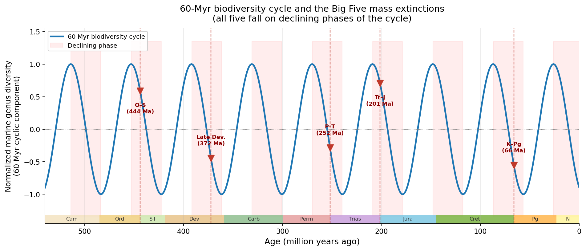
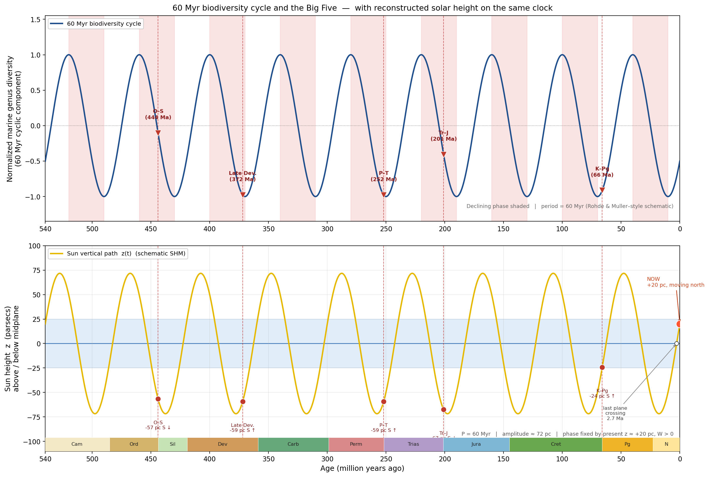

# Biodiversity, the Big Five, and the galactic cycle

Rohde & Muller (2005) analyzed Jack Sepkoski’s compendium of first and last strati-graphic appearances for 36,380 marine animal genera across the Phanerozoic (roughly the last 542 million years). After updating the time scale and removing the long-term trend, they found a statistically strong ~62 ± 3 million-year cycle in standing diversity.

The cycle is most pronounced among short-lived genera (those lasting less than about 45 million years). It appears in both origination and extinction rates but is strongest in overall diversity. The five major mass extinctions, or “The Big Five”, identified by Raup and Sepkoski ‒ end-Ordovician (444 Ma), Late Devonian (372 Ma), end-Permian (252 Ma), end-Triassic (201 Ma), and end-Cretaceous (66 Ma) ‒ all fall on the declining phases of the cycle, suggesting they may be an expression of the same periodicity rather than wholly independent events.

A weaker secondary cycle of about 140 million years is also present, though it is less robust because the record contains only a few oscillations. Different clades vary in sensitivity: corals, sponges, arthropods and trilobites track the 62-Myr rhythm closely, whereas fish, cephalopods and gastropods do not. Longer-lived, geographically widespread genera tend to be more resistant.

The authors examined a range of possible drivers (sea-level change, climate, volcanism, galactic motion, etc.) but found no compelling match. Because galactic motion as a potential driver could be a plausible explanation, as galactic cycles span hundreds of millions of years, this is the option that we explored.

The Sun’s orbit around the Milky Way has a period Pϕ commonly quoted near 230–250 Myr, set by present radius R0 and circular speed ϴ0. Considering four cardinal phases or seasons, a quarter of that range is 58–62 Myr. The Sun also oscillates through the galactic midplane with a full vertical period Pz of roughly 60–72 Myr. Today it sits ~15–21 pc north of the plane, moving further north; the last midplane crossing was ~2.7 Myr ago.

So we have three cycles that sit in the same band: the fossil cycle (62 Myr), a vertical period Pz (60-72 Myr), and the galactic seasons Pϕ/4 (58-62 Myr) at present R. If the diversity rhythm is a quarter sector or season of the galactic year (and vertical period Pz), then the period is a function of where the Sun is:
<h3 align="center">
  $P_4(R)∼ \frac{P_ϕ(R)}{4}∼\frac{πR}{2 Θ(R)}$
</h3>
<h6 align="center">(formula 1)</h6>

and Pz(R) likewise follows local disk density. The ~60–62 Myr number would then be only the value at present R. Farther in, the cycle should run faster; farther out, slower.

In this picture geometry is not an alternative to mass: the disk defines a plane and a year, and “where the Solar System sits” in that frame could modulate conditions on Earth, even if the micro-physical driver is unknown. Jitter of several Myr would be expected, as with seasons that do not begin on the solstice to the day.

If an approximate 60 Myr rhythm is indeed in place due to current R, we can draw a corresponding sine wave through today’s height and the 2.7 Ma crossing. In that case the Big Five would not just be on the declining phase, but also south of the midplane. Since we cannot reliably reconstruct the position of the Sun on the galactic disk over many millions of years, we must consider a reasonable variability of R over the entire period.

A 540 Myr window is more than two galactic years. Ordinary epicyclic motion only swings R by a few hundred parsecs and changes Pϕ by a few percent. Radial migration can move the guiding radius by kiloparsecs over the Sun’s lifetime, but much of that may have happened early. The last two orbits need not place the Sun in a different regime. If they still drifted R by ~0.5–1 kpc, Pϕ/4 would wander by ~6–12% ‒ still about 60 Myr, wide enough to blur a sharp 62 ± 3 Myr Fourier peak if the drift were steady.

If biodiversity is indeed locked to the galactic year, the 60 Myr period isn’t expected to be fixed during Earth’s lifespan, but should follow P4(R) as defined by formula 1.

